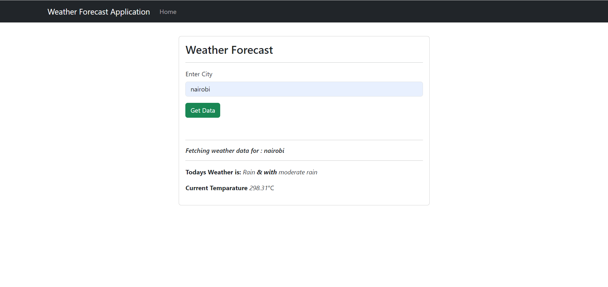

e# Weather Application

## About Weather App

Weather App is Laravel powered web application that is able to capture city and then display the weather information
Contains features for

- Enter City desired to obtain the weather information
- Display the information as the details are fetched from wearther open API

Laravel is accessible, powerful, and provides tools required for large, robust applications.

## sample

## License

The Laravel framework is open-sourced software licensed under the [MIT license](https://opensource.org/licenses/MIT).
